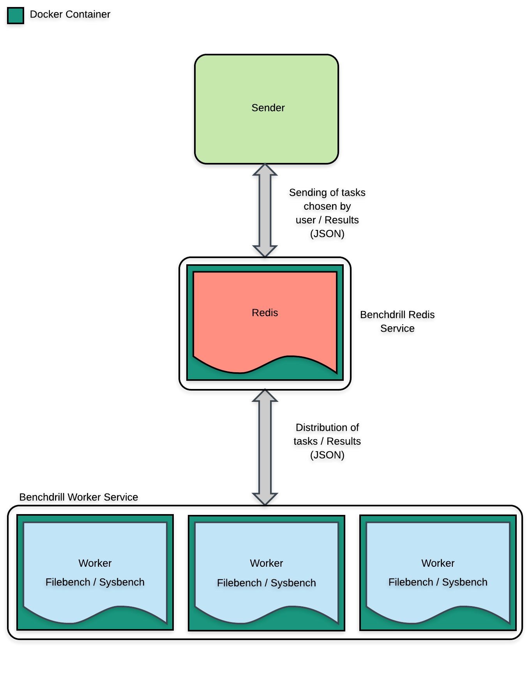

# Benchdrill

Benchdrill is a benchmarking tool based on [Machinery](https://github.com/RichardKnop/machinery). It allows to load charges thanks to Machinery’s workers, which are distributed with Docker Compose in a Docker Swarm. Workers are then ready to execute tasks to run tools as [Filebench](https://github.com/filebench/filebench).

## Installation
First you need Go 1.8 and Docker v17.05. Then, after cloning this repository with Git, run the following commands in a terminal in the root directory of Benchdrill:

``` shell
$ docker build -t hub.rnd.alterway.fr/wolphin-project/benchdrill:master .
$ ./stack/benchdrill-network
$ ./stack/benchdrill-deploy
```

## Usage
Benchdrill commands are run with `stack/benchdrill-cli`. Currently there are 2 commands with Benchdrill: `send_cmd_args` and `send_cmd_file`. The first one send a command to a worker, possibly with arguments, the second one allows to send the content of a local file given as an argument to a worker, which will save the content on a file then use it.

Two benchmark tools are currently supported: [Sysbench](https://github.com/akopytov/sysbench) and [Filebench](https://github.com/filebench/filebench). Below two commands you can run, given as examples.

``` shell
$ ./stack/benchdrill-cli send_cmd_args "sysbench --time=5 cpu run"
```

This command will send the command quoted to a single worker, which will run a built-in CPU test of Sysbench for 5 seconds.

``` shell
$ ./stack/benchdrill-cli --times=3 send_cmd_file "filebench -f" < readfiles.f
```

This command will send the command quoted 3 times as 3 separate and identical tasks executed simultaneously (thanks to the ``--times`` option); it will run the test written in `readfiles.f` (provided in the repository as an example).

## Architecture



The sender sends his jobs to the message broker Redis, which distribute it among the workers, either sequentially or in parallel. After finishing their jobs, workers send the results to Redis which transmits it back to the sender. Redis and each worker are in separate Docker container on the same cluster.

## License
Mozilla Public License 2.0
